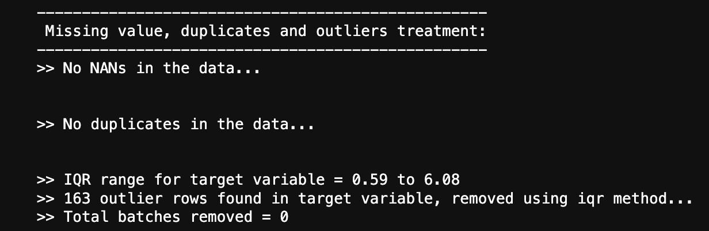
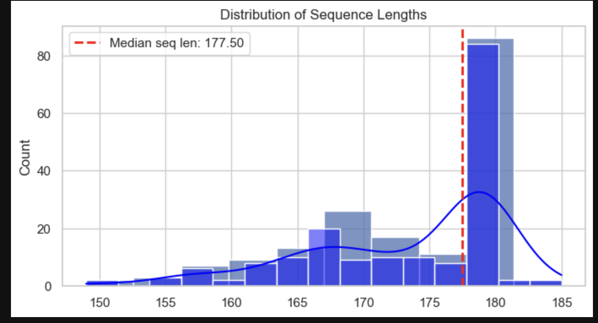
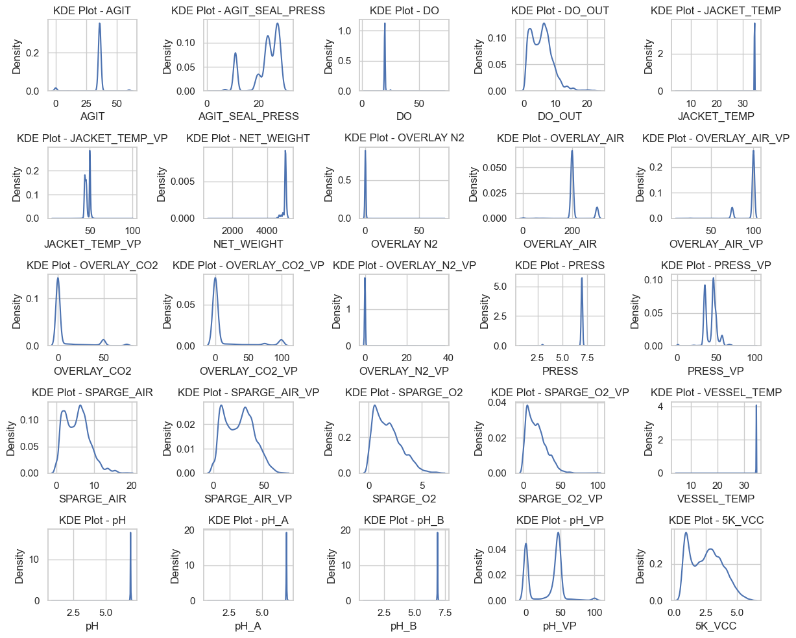
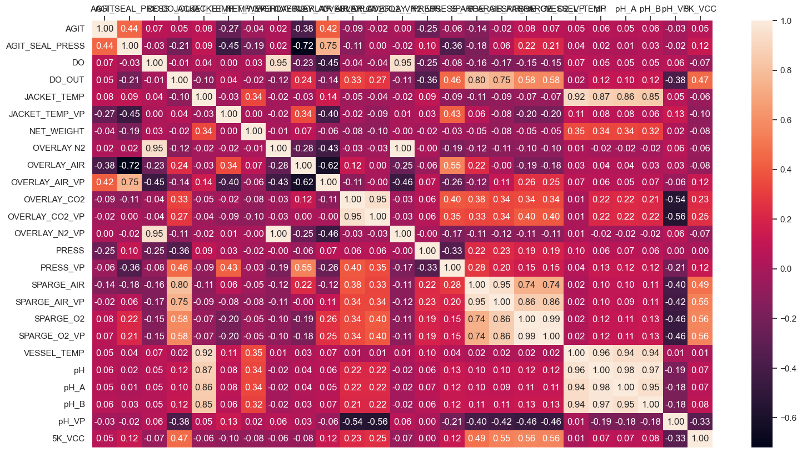
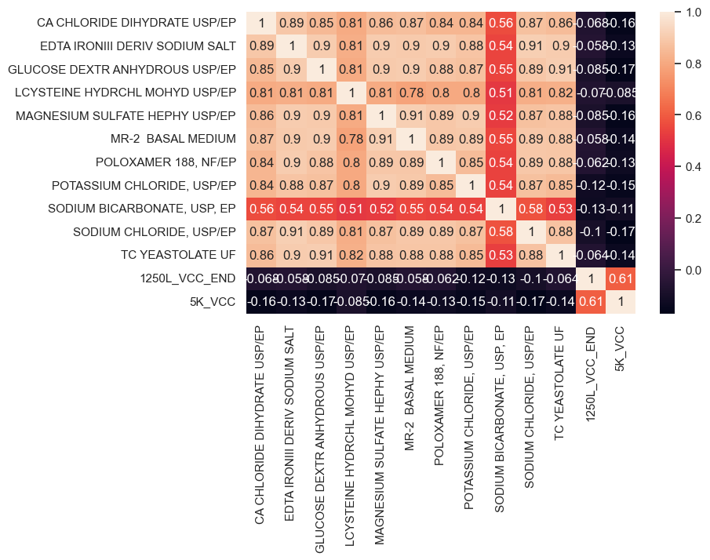

# Multivariate Timeseries Cheatsheet

This repository contains data preprocessing and standard EDA tools for multi-variate time-series data (panel data) to get started with quick EDA on any new dataset that one may receive.
It also optionally provides the framework to analyze any associated meta-data files related to the timesereis data (such as raw materials used in each batch, patient demographics, etc)

## Steps to use the tool
The usage of the tool is very simple. 

1. Place your data in the `./data` folder.
2. Open `mv_ts_EDA.ipynb` and edit the `config` dict at the top
3. Press RunAll for sequential execution of all the analysis.

## Features 

The following series of steps are performed in the end-to-end run of the NB:

1. **Read Data** : Read data (seq + static) and display basic statistics  

2. **Missing Value Treatment:**  Check for NaNs and treat them. Two treatment options are available:  
   2.1 **Drop** (`drop`): Drops all the rows with NaNs. If the percentage of NaNs is low, this can be used. Otherwise, significant data size reduction may occur.  
   2.2 **Impute** (`impute`) : Imputes the NaNs using either ***Median***  or ***Mean***  

3. **Duplicates Removal:**  If any duplicate rows exist, they are dropped.  

4. **Outlier Detection** : Identifies outliers in the target variable. Removes all data related to those identifiers (i.e., from both static and sequential data).  Two detection methods are provided:  
   4.1 **IQR-based Removal** (`iqr`) : Removes outliers based on the inter-quartile range.  *To Do: Add an option to change IQR limits (currently fixed at 99%).*  
   4.2 **Z-score-based Removal** (`z-score`)  : Removes outliers based on the Z-score method, where values beyond a specified threshold (e.g., |Z| > 3) are considered outliers. To Do: Add an option to adjust the Z-score threshold.

5.  **Sequence Length distribution**: since we have panel data, it is good to check the variable sequence lengths to know the min, max and median in order to decide on a reasonable max_seq_len for padding later.

6.  **Time-series decomposition**: to decompose the various time-series variables into trend, seasonality and residuals to understand the nature of underlying data better (such as whether we have more of statitionary series, etc to drive modeling decisions accordingly).

7. **Univariate Analysis**: You can explore the univariate properties of time-series variables to understand their distributions and spread of values. It also helps to understand the different scales of each variable. Currently, this can be done using two methods:  
   7.1 **Kernel Density Estimates (KDEs)**: Visualizes the probability density function of numerical variables, providing insight into their distribution and smooth variations.  
   7.2 **Box plots**: Displays the spread, central tendency, and potential outliers of numerical variables, highlighting differences in scale and variability.

8. **Bi-variate correlations ** : look at the pairwise Pearson correlation coefficient between variables ro reveal positive/negative or strong/weak correlations between the variables or of the variables with the target variable.

***[NOTE]*** : if you have static meta-data also available alongwith the time-series variables, you can check for the cross-correlation between meta-data variables and the time-series variables too in the provided code. This helps to understand how the conditional variables impact the subsequent time-series patterns (for instance, demographics of patients affecting their medical journeys)

9. 

   

